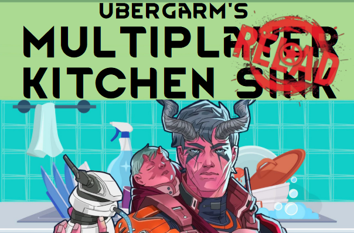

RimWorld 1.4 Multiplayer Kitchen Sink Reloaded Modpack
===

[](https://creativecommons.org/licenses/by-nc/3.0/)
[](http://rimworldgame.com/)

Suggested DLC:
* Royalty
* Biotech

Multiplayer:
* Zetrith's Multiplayer Mod
* Multiplayer Compat

A few years have gone by and now its time to try again. This modpack is
a slightly less ambitious updated reload of a previous pack that never
stopped desync'ing.

## Installation

1. Click `Subscribe to all` on the  [Mod Collection](https://steamcommunity.com/sharedfiles/filedetails/?id=3174706609) (like and favorite if you choose)
2. Download the [latest config files here](https://github.com/ubergarm/rimworld-mp-kitchen-sink-reloaded/archive/master.zip)
3. Copy/paste the `Config`, `HugsLib`, and `ModLists` folders from the zip replacing yours e.g. `C:\Users\%USERPROFILE%\AppData\LocalLow\Ludeon Studios\RimWorld by Ludeon Studios\Config` or in Linux `~/.config/unity3d/Ludeon Studios/RimWorld by Ludeon Studios/Config`
4. For now load the provided `mpksr-v0.1.xml` file after getting a basic mod list going with Hamony and Fluffy's Mod Manger

TODO: Address pinning versions so nothing changes during a play-through...

## Loose Stairs
Known source of desyncs:

* RimHud - don't click self-tend toggle in RIMHud UI - use Health Tab button instead!??
* Alpha Genes - don't use string genes to transmit genes to selected target (is bugged, only xfers names but not genes)??
* More Faction Interaction - Avoid Help With Harvest, Diplomatic Marriage, Annual Expo Event (disable this one in config)
* Numbers - Hunt/Tame in Wildlife Tab causes desync (use the overworld gizmo instead)
* Vanilla Persona Weapons Expanded - changing persona weapon appearence causes desync, reachin baron/baroness and picking a custom persona weapon causes desync (have server do it alone and save)
* Vanilla Hair Expanded - don't use the barber table
* Set Up Camp - has bugs with multi-faction multiplayer mode (seems okay otherwise?)
* Smart Medicine - just to be safe I disabled stock-up in the configs, you can manually pickup some meds to your doc's inventory - maybe fixed but i'm being safe as it was an old issue psure
* Replace Stuff - don't use replace tool, just place new materials over old ones instead
* Grazing Lands - chance to destroy grass on consumption must remain 0% - just use default config and should be safe
* Follow Me - do *not* use the cinematic camera or RNG gets desynced
* Designator Shapes - "flood fill" causes desyncs
* Colony Groups - Group Menu -> Work -> Form Caravan desyncs, don't use any features except as a colonist bar replacement
* Work Tab - don't use favorites menu it may desync
* Yayo - not known for desyncs, but just to be safe use ammo as it is just too much more variables

## Unknown Quantities
These mods have nothing listed in compatibilty spreadsheet:

* Startup Impact 1.4
* Mod Error Checker
* Pets can eat from Wall Refrigiators
* Better Surgery
* More Slaves - seems okay, didn't fuss while trading
* Medicines+ 1.4 - hypnotol seems bugged and throws errors but does not desync...
* The Price is Right - seems okay, didn't fuss while trading
* Tacticowl - it is listed as supported on MPCompat and its 3x base mods are compat
* Float Sub-menus
* Searchable Menus
* ResearchPal - 1.4 Repackage
* Invisible Conduit
* Incident Person Stat (Continued)
* Holy Washer (Continued)
* Heat Map (Continued)
* Grenad Fix - Rearmed
* Fluffy Breakdowns
* Fermenter (Continued)
* Faction Control 1.4
* Deep Storage Plus (Continued)
* No Skill Decay - claims to be native MP compat

## Testing

Start up an MP server and connect to yourself by starting a second copy
of RimWorld.
```bash
LC_ALL=C ~/.local/share/Steam/steamapps/common/RimWorld/RimWorldLinux -logfile /tmp/rimworld_test_client_log
```

## Development
Copy all configs in linux here:
```bash
rsync -avh /home/garm/.config/unity3d/Ludeon\ Studios/RimWorld\ by\ Ludeon\ Studios/Config ./
rsync -avh /home/garm/.config/unity3d/Ludeon\ Studios/RimWorld\ by\ Ludeon\ Studios/HugsLib ./
rsync -avh /home/garm/.config/unity3d/Ludeon\ Studios/RimWorld\ by\ Ludeon\ Studios/ModLists ./
git checkout Config/Knowledge.xml
git checkout Config/Mod_1662119905_DubsMintMinimapMod.xml
git checkout Config/Mod_2606448745_Multiplayer.xml
```

## References
* [RimWorld Multiplayer Kitchen Sink Reloaded Modpack Steam Workshop](https://steamcommunity.com/sharedfiles/filedetails/?id=3174706609)
* [RimWorld Multiplayer Kitchen Sink Reloaded Modpack GitHub](https://github.com/ubergarm/rimworld-mp-kitchen-sink-reloaded)
